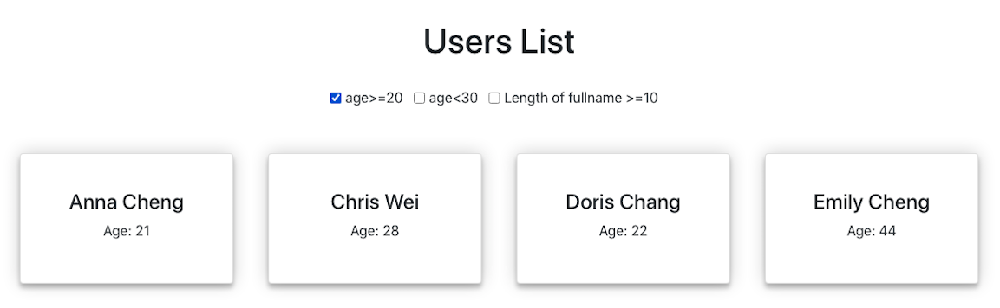

## Project setup locally
 
   Clone the Repository :
        `git clone https://github.com/riti12345/apertum.git`

   install all the npm files and run on local server :
    `npm install`

## Available Scripts

In the project directory, you can run:

### `npm start`

Runs the app in the development mode. 
Open [http://localhost:3000](http://localhost:3000) to view it in the browser.

The page will reload if you make edits. 
You will also see any lint errors in the console.

## Project description
 A simple web application with 2 pages and serving the following purpose:
 
● Login Page: To allow users to log in to the application.

● Users List Page: To list all the users currently in the system.

● All the users need to be listed using a reusable Card Component.

● Users List Page should have a filter button to let the end user filter users list with
conditions as below:
      age>=20 && age<30 && length of full name >=10
      

